### Exercici 1

Aquí instal·laràs les **llistes negres** perquè el Filtre d’URL tingui categories per bloquejar webs.   
Activa el proxy i el Filtre d’URL; per filtrar **HTTPS** fes servir **mode convencional (no transparent)**.

```bash
Xarxa -> Proxy web
  - Activar Proxy web
  - Activar Filtre d’URL
  - Mode: Convencional (no transparent)  # si vols que afecti HTTPS
```
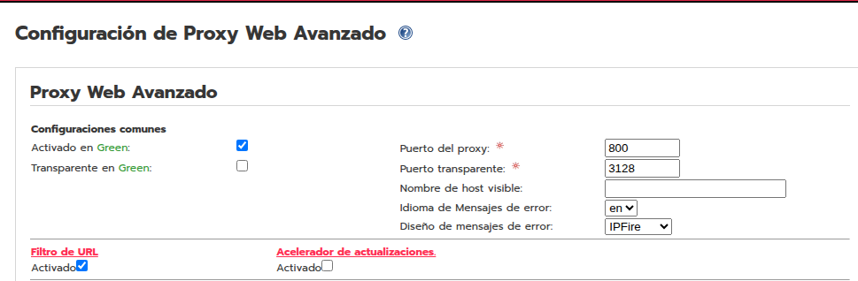

Actualitza la blacklist i comprova que ja tens categories. 

```bash
Xarxa -> Filtre d’URL -> Manteniment
  - Actualitza ara   # o puja un fitxer .tar.gz
  - Desa i reinicia/recàrrega
  - Verifica que surten categories
```
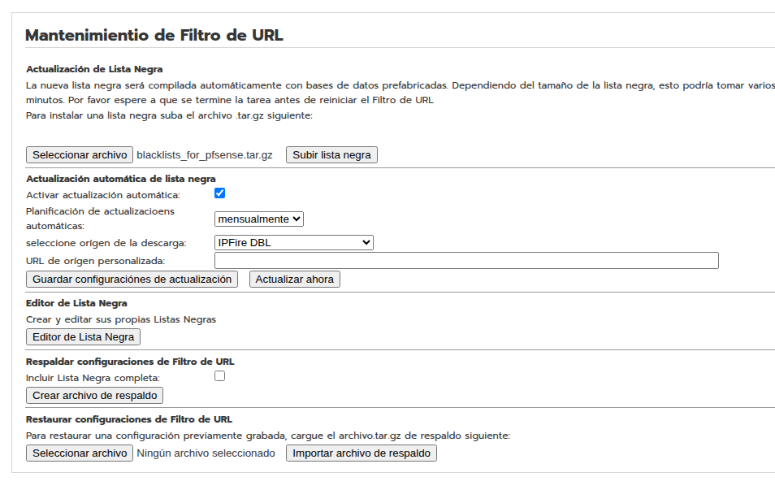

***

<br>
<br>
<br>
<br>

### Exercici 2

Aquí bloquejaràs per **categories** i ho provaràs amb webs.   
Marca les categories, desa i reinicia/recàrrega.

```bash
Xarxa -> Filtre d’URL
  - Bloqueja: bank
  - Bloqueja: radio
  - Desa i reinicia/recàrrega
```

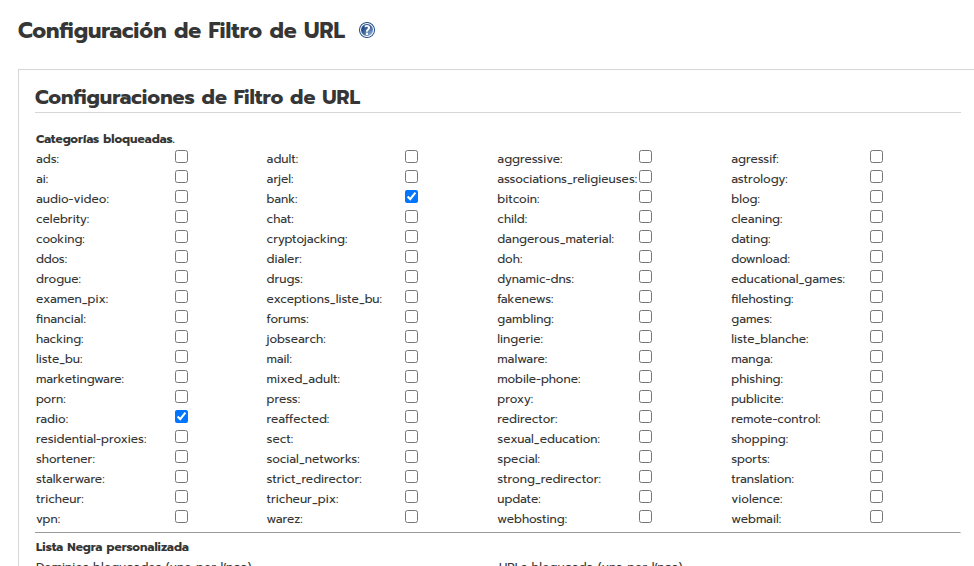

Fes les proves des d’un PC que vagi **pel proxy** (si no, el filtre no actua). 

```bash
Proves:
  - https://ing.es
  - https://ah.fm
```

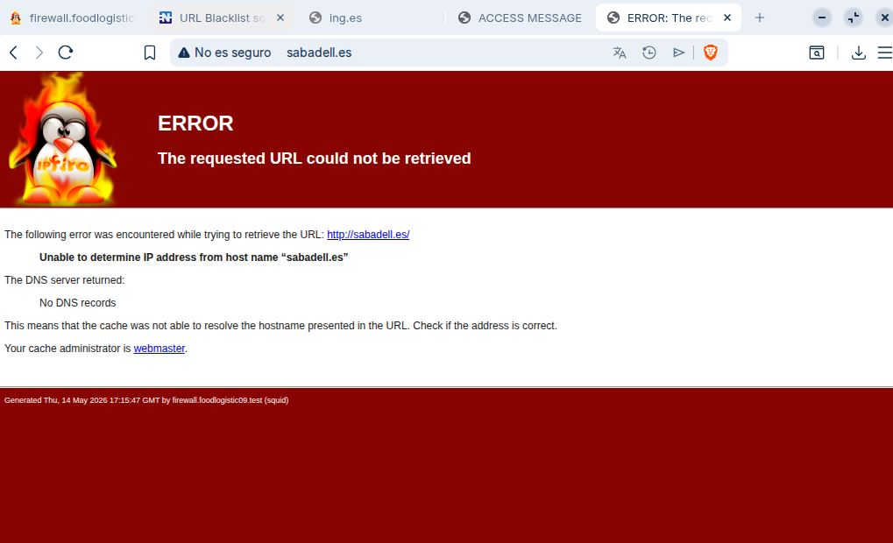
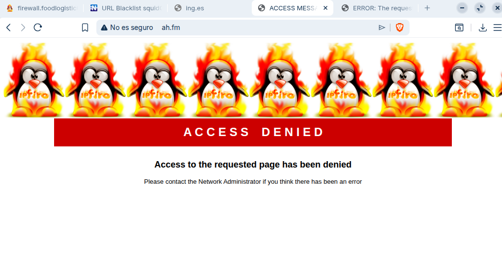

***

<br>
<br>
<br>
<br>

### Exercici 3

Aquí bloquejaràs **dos dominis sencers** amb la llista negra personalitzada.   
Activa la llista negra personalitzada i afegeix els dominis (1 per línia).

```bash
Xarxa -> Filtre d’URL
  - Activar: Llista negra personalitzada
  - Dominis bloquejats (1 per línia):
    elnacional.cat
    tecnocampus.cat
  - Desa i reinicia/recàrrega
```

Comprova-ho des d’un PC que passi pel proxy.

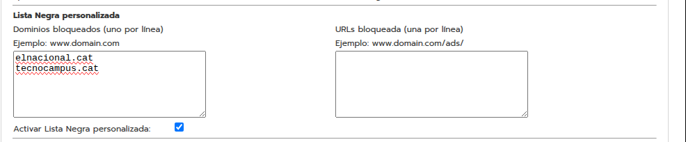
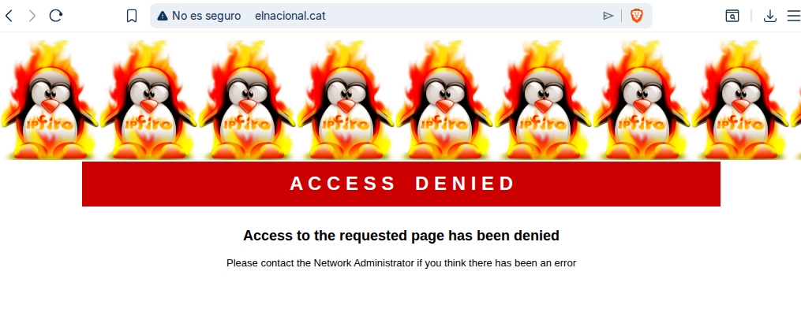
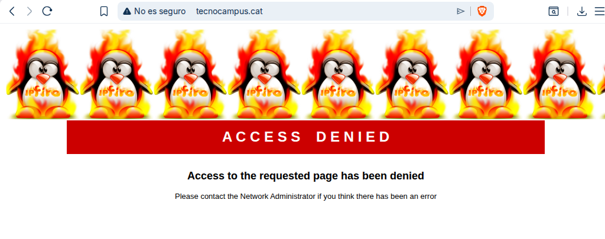
***

<br>
<br>
<br>
<br>

### Exercici 4

Aquí bloquejaràs **una URL concreta** d’un web, però no tot el domini.   
Posa la ruta a **URLs bloquejades** (sense `https://`) i desa. 

```bash
Xarxa -> Filtre d’URL -> Llista negra personalitzada
  - URLs bloquejades (1 per línia):
    www.myside.com/blogs/
```
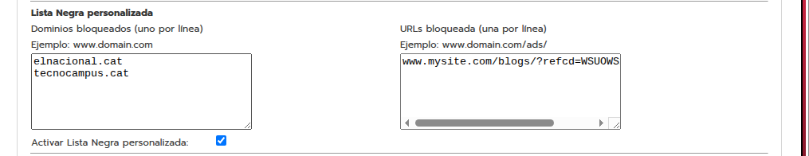

Verifica que cau aquesta URL i que la resta del domini funciona.

```bash
Proves:
  - https://www.myside.com/blogs/
```
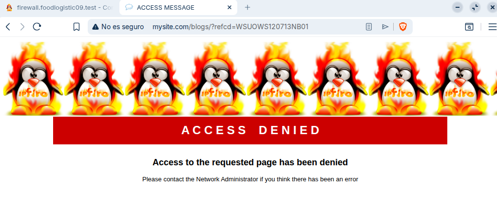

***
<br>
<br>
<br>
<br>

### Exercici 5

Aquí bloquejaràs per **paraula** i faràs una **excepció** perquè un web sí que entri.   
Activa la llista d’expressions i escriu la paraula a bloquejar.

```bash
Xarxa -> Filtre d’URL
  - Activar: Llista d’expressions personalitzada
  - Expressions (1 per línia):
    anime
  - Desa i reinicia/recàrrega
```

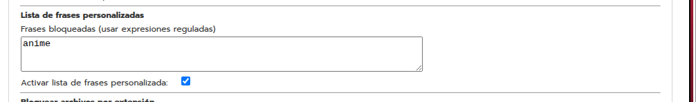

Activa la llista blanca i posa el domini permès (la whitelist té prioritat). 

```bash
Xarxa -> Filtre d’URL
  - Activar: Llista blanca personalitzada
  - Dominis permesos (1 per línia):
    animenewsnetwork.com
  - Desa i reinicia/recàrrega
```

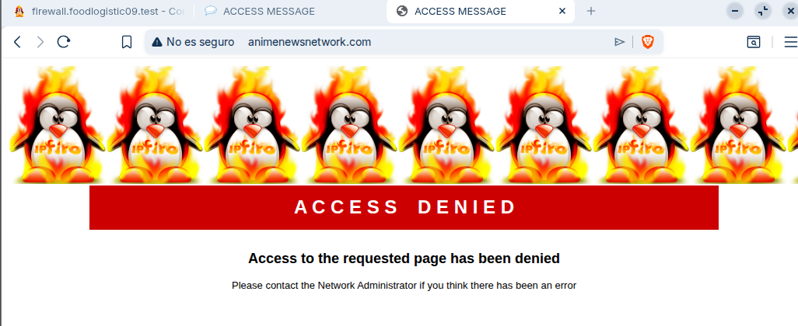

***

<br>
<br>
<br>
<br>

### Exercici 6

Aquí faràs que Internet funcioni o es talli segons **hores i dies** des del proxy.   
Crea una regla amb la IP del PC (o la xarxa), posa dies i hores, i marca **Permetre** o **Denegar**.

```bash
Xarxa -> Proxy web -> Restriccions de temps
  - Origen (IP del PC o subxarxa)
  - Dies (ex: Dl-Dg)
  - Franja horària (ex: 18:00-19:00)
  - Acció: Permetre o Denegar
  - Desa i recàrrega/reinicia el proxy
```

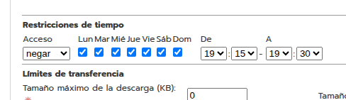
<br>
<br>
<br>
<br>


# FORA DER LA ZONA HORARIA

<br>
<br>
<br>
<br>

# DINTRE DER LA ZONA HORARIA
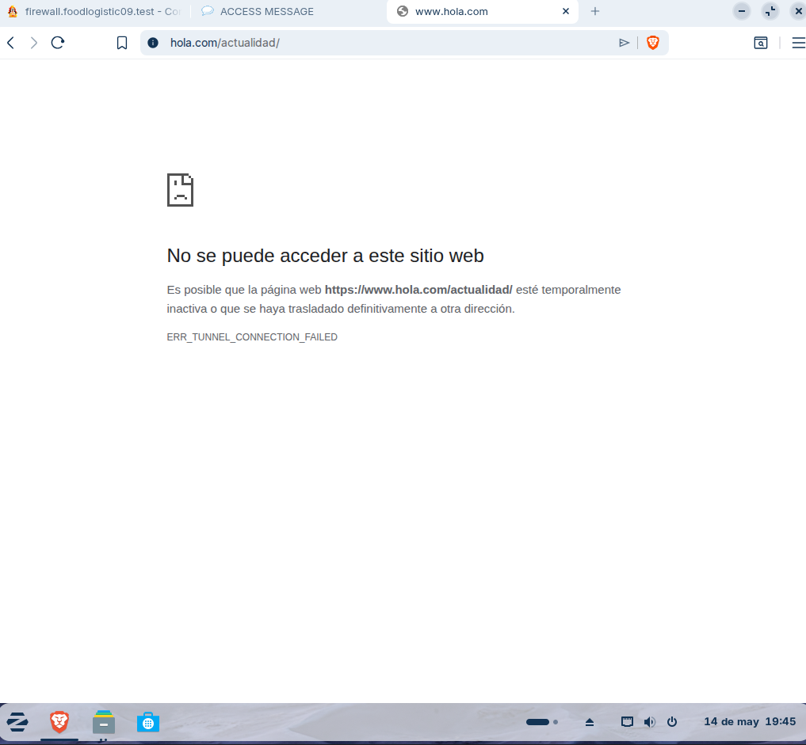

Prova dins i fora de l’horari; només s’aplica si el PC navega **pel proxy**. 
