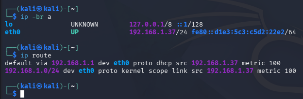
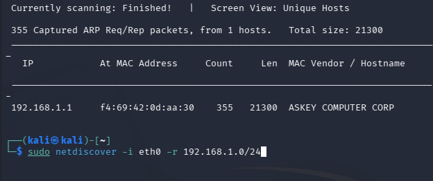
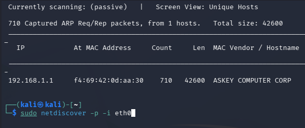
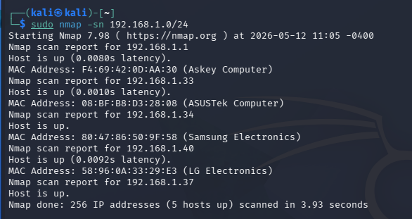
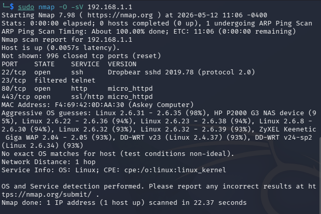

# Guia Kali - Pau Guerrero

## 0) Preparació

### Què fer
- Configura la VM de Kali en **Adaptador pont (Bridge)**.
- Configura la xarxa de Kali en **DHCP** (IP automàtica).
- Mira les dades de xarxa (per saber què posar després als comandaments):

```bash
ip -br a
ip route
````

### Què ha de sortir

*   A `ip -br a`: una interfície **UP** (p. ex. `eth0` / `ens33` / `wlan0`) amb una IP tipus `X.X.X.X/24`.
*   A `ip route`: una línia que diu `default via X.X.X.X` (aquesta és la IP del router/gateway) i una línia amb la xarxa tipus `X.X.X.0/24` (aquest és el rang).



***

## 1) Exercici 1 — Netdiscover mode actiu

### Què fer

Executa (substituint):

*   `INTERFICIE` per la que tens **UP** (ex: `eth0`)
*   `RANG` per la teva xarxa (ex: `192.168.1.0/24`)

```bash
sudo netdiscover -i INTERFICIE -r RANG
```

Deixa’l uns segons i para amb **Ctrl + C**.

### Què ha de sortir

Una llista/taula amb equips detectats, normalment amb camps tipus:

*   IP
*   MAC
*   Vendor/Fabricant

Hauries de veure diversos dispositius de la xarxa (PCs, mòbil, router, etc.).



***

## 2) Exercici 2 — Netdiscover mode passiu

### Què fer

Executa (substituint `INTERFICIE`):

```bash
sudo netdiscover -p -i INTERFICIE
```

Deixa’l 1–2 minuts i para amb **Ctrl + C**.

### Què ha de sortir

Una llista d’IP/MAC (i a vegades vendor) **només** dels equips que generen trànsit mentre escoltes.  
És normal que surtin **menys** equips que en actiu.



***

## 3) Exercici 3 — Nmap 

### 3.1 Detectar equips de la xarxa

#### Què fer

```bash
sudo nmap -sn RANG
```

#### Què ha de sortir

Resultats tipus:

*   `Nmap scan report for X.X.X.X`
*   `Host is up`

Un resum final amb quants hosts estan “up”.



### 3.2 Escaneig detallat del router 

#### Què fer

Agafa `IP_ROUTER` de la línia `default via ...` i executa:

```bash
sudo nmap -O -sV IP_ROUTER
```

#### Què ha de sortir

*   Informació del sistema (OS): línies tipus `OS details`, `Running`, `Device type` (pot sortir “no exact matches” si no ho pot determinar; però ho intenta).
*   Serveis i ports oberts: una taula amb:

<!---->

    PORT   STATE  SERVICE  VERSION

Ports oberts (ex: 80, 443, 22, 53… depèn del router).



***

## 4) Diferències entre actiu i passiu

En mode actiu, netdiscover funciona com si “preguntés” per la xarxa: envia peticions per descobrir quins dispositius hi ha connectats. Per això, normalment troba més equips i més ràpid, encara que alguns estiguin quiets i no estiguin fent res en aquell moment.

En mode passiu, netdiscover fa el contrari: no envia res, només es queda escoltant el que passa a la xarxa. Això vol dir que els dispositius només apareixen si en aquell moment estan generant trànsit, i per això sovint surten menys equips o triguen més a sortir.

