# GUIA - Pau Guerrero
## Crear OU Linux, grup linuxadmins i usuari linus (Windows Server)

1. Obre **Active Directory Users and Computers**.
2. Crea una **OU** amb nom: **Linux**.
3. Dins de la OU **Linux**, crea un **grup**:
   - Nom: `linuxadmins`
   - Tipus: **Security**
   - Abast: **Global**
4. Dins de la OU **Linux**, crea un **usuari**:
   - Nom d’usuari: `linus`
   - Contrasenya: la que s’hagi definit a l’exercici
5. Afegeix `linus` com a membre del grup `linuxadmins`.

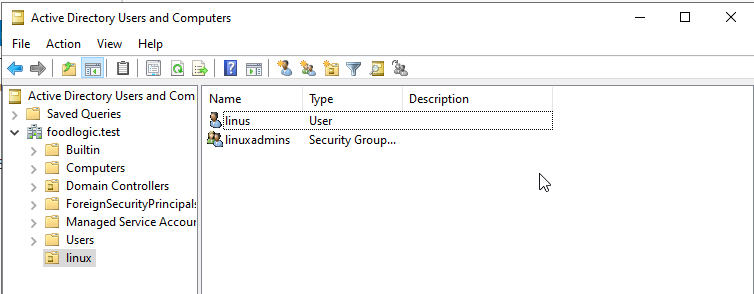

---

## Posar la IP del servidor al Zorin (DNS del DC)

> Cal configurar el Zorin perquè utilitzi com a **DNS** la **IP del Windows Server (DC09)**.

1. A Zorin: **Configuració → Xarxa**.
2. Obre la teva connexió (cable o Wi‑Fi) i entra a **Configuració/Detalls**.
3. A **DNS**, posa la **IP de DC09**.
4. Desa i desconnecta/reconnecta la xarxa.

Comprovacions:
```bash
ping -c 2 DC09
ping -c 2 foodlogic.test
````

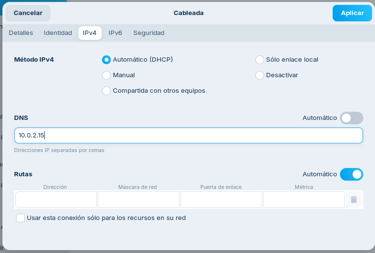

***

## Instal·lar SSSD i eines del domini

Instal·la els paquets necessaris:

```bash
sudo apt update
sudo apt install realmd sssd sssd-tools adcli packagekit \
  libnss-sss libpam-sss samba-common-bin krb5-user
```
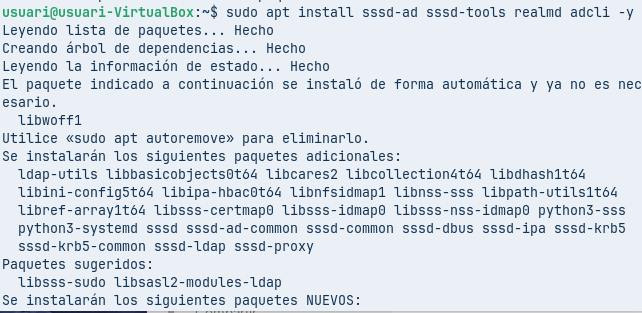

***

## Canviar el hostname

1.  Canvia el nom del PC:

```bash
sudo hostnamectl set-hostname zorin
```

2.  Revisa `/etc/hosts`:

```bash
sudo nano /etc/hosts
```

Assegura una línia així:

```text
127.0.1.1   zorin
```

3.  Reinicia:

```bash
sudo reboot
```
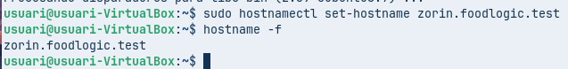

***

## Comprovar zona horària i hora

Comprova estat:

```bash
timedatectl
```

Si cal, posa la zona horària:

```bash
sudo timedatectl set-timezone Europe/Madrid
```

***

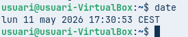
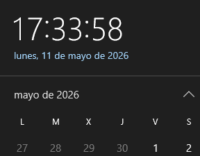

## realm discover

Comprova que el Zorin troba el domini:

```bash
realm discover foodlogic.test
```
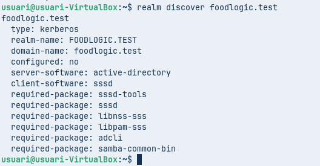

***

## sudo realm join

Uneix el Zorin al domini:

```bash
sudo realm join foodlogic.test -U Administrator
```

Comprova que ha quedat unit:

```bash
realm list
```

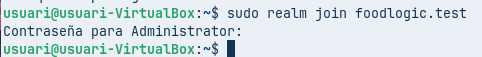

***

## Comprovar que l’ordinador s’ha unit a l’AD (Computers)

Al Windows Server:

1.  Obre **Active Directory Users and Computers**.
2.  Ves a **Computers** (o a la OU on s’hagi creat l’objecte).
3.  Verifica que apareix el PC (per exemple `zorin`).

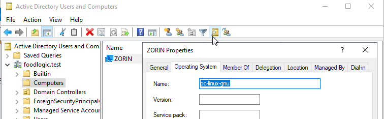

***

## sudo pam-auth-update

Activa la creació automàtica del directori `home` per a usuaris de domini:

```bash
sudo pam-auth-update --enable mkhomedir
```
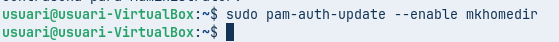

***

## Iniciar sessió amb l’usuari creat

A la pantalla d’inici de sessió de Zorin, entra amb:

*   Usuari: `linus@foodlogic.test`
*   Contrasenya: la del domini


***

## Comprovar amb id i pwd

Un cop iniciada la sessió:

```bash
id
pwd
```
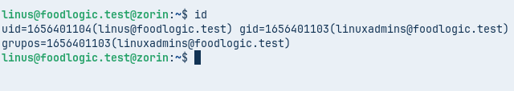
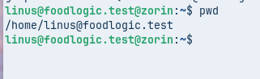


***

## /etc/sudoers.d/domainadmins

Dona permisos de `sudo` al grup del domini.

1.  Crea el fitxer amb `visudo`:

```bash
sudo visudo -f /etc/sudoers.d/domainadmins
```

2.  Escriu aquesta línia:

```text
%linuxadmins@foodlogic.test ALL=(ALL) ALL
```

3.  Assigna permisos correctes:

```bash
sudo chmod 0440 /etc/sudoers.d/domainadmins
```

4.  Prova `sudo`:

```bash
sudo -l
```

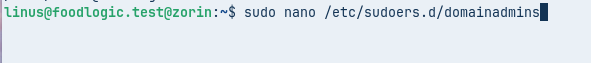
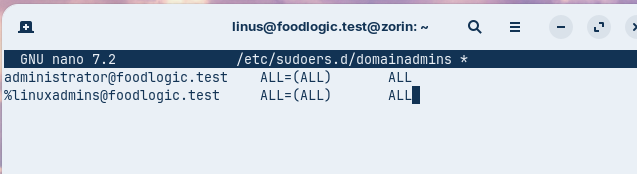

***

## Control d’accés (qui pot entrar al Zorin)

Permet només el grup `linuxadmins`:

```bash
sudo realm deny --all
sudo realm permit -g "linuxadmins"
```

Comprova:

```bash
realm list
```
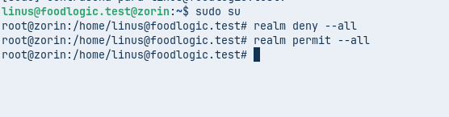
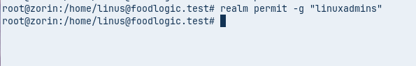

***

## sudo apt install python3-smbc

Instal·la el paquet demanat:

```bash
sudo apt update
sudo apt install python3-smbc
```
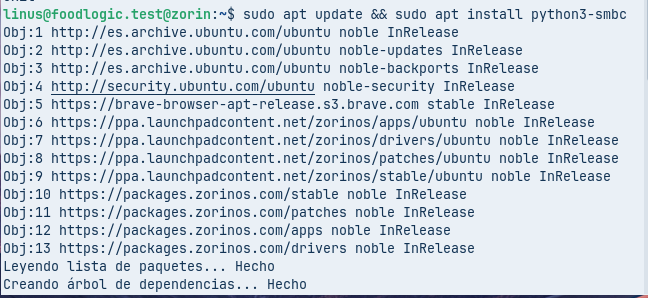

***

## Accedir a la xarxa (SMB)

### Des del gestor de fitxers (GUI)

1.  Obre **Fitxers** → **Altres ubicacions**.
2.  Escriu:
    *   `smb://DC09/`
3.  Si demana credencials:
    *   **Domini:** `FOODLOGIC`
    *   **Usuari:** `linus`
    *   **Contrasenya:** la del domini


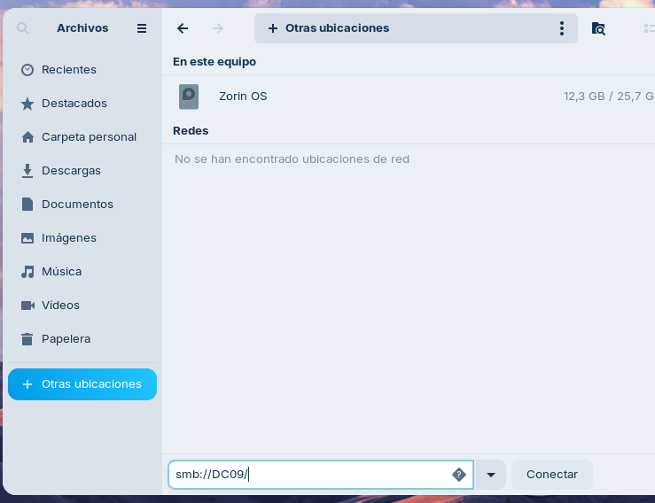
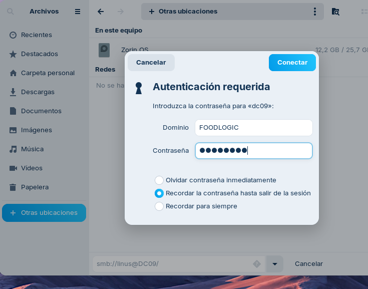
