# Guia - Pau Guerrero

# 1. Instal·lació i preparació

## Instal·lació de Samba

Primer cal instal·lar el servei Samba al sistema Linux:

```bash
sudo apt update
sudo apt install samba
```
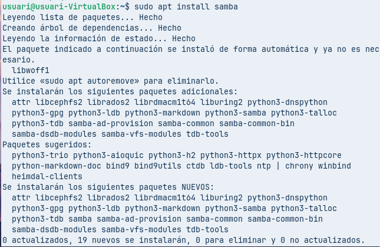

Això instal·la totes les eines necessàries per compartir carpetes a la xarxa.

***

## Creació de carpetes

Es creen dues carpetes que després es compartiran:

```bash
sudo mkdir -p /srv/samba/publica
sudo mkdir -p /srv/samba/compartida
```


Aquestes carpetes seran utilitzades més endavant per fer proves d’accés.

***

## Creació del grup

Per gestionar millor els permisos, es crea un grup:

```bash
sudo groupadd sambashare
```


Aquest grup servirà per agrupar els usuaris que podran accedir a les carpetes compartides.

***

## Assignació de permisos

S’ha de definir qui pot accedir a les carpetes:

```bash
sudo chown root:sambashare /srv/samba/publica
sudo chown root:sambashare /srv/samba/compartida

sudo chmod 770 /srv/samba/publica
sudo chmod 770 /srv/samba/compartida
```

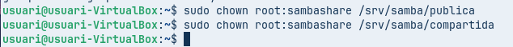

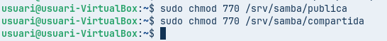

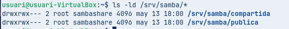

Així, l’usuari root i el grup podran llegir i escriure, però altres usuaris no tindran accés.

***

## Creació d’usuaris

Es creen tres usuaris sense accés al sistema:

```bash
sudo useradd -m -s /sbin/nologin -G sambashare samba1
sudo useradd -m -s /sbin/nologin -G sambashare samba2
sudo useradd -m -s /sbin/nologin -G sambashare samba3
```
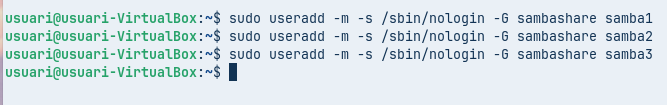

Aquests usuaris només s’utilitzaran per Samba.

***

## Afegir usuaris a Samba

Cada usuari s’ha d’afegir al servei:

```bash
sudo smbpasswd -a samba1
sudo smbpasswd -a samba2
sudo smbpasswd -a samba3
```

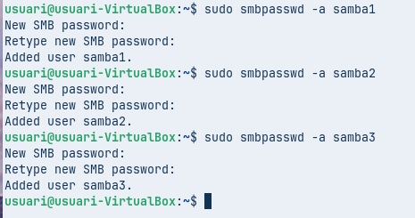

***

## Reiniciar configuració

Es recomana guardar la configuració original i crear-ne una nova:

```bash
sudo mv /etc/samba/smb.conf /etc/samba/smb.old
sudo nano /etc/samba/smb.conf
```

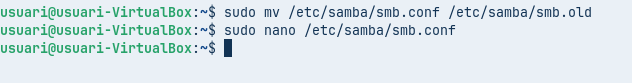

***

# 2. Carpeta pública

## Configuració

Es crea una carpeta accessible per tothom, sense usuari:

```bash
[global]
workgroup = WORKGROUP
security = user
map to guest = bad user

[publica]
path = /srv/samba/publica
browseable = yes
guest ok = yes
read only = yes
```

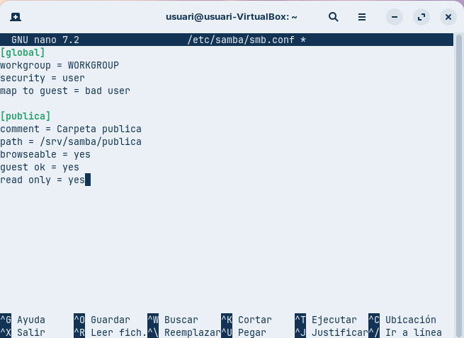

Aquesta configuració permet que qualsevol usuari accedeixi però només en mode lectura.

***

## Aplicar canvis

```bash
testparm
sudo systemctl restart smbd
```

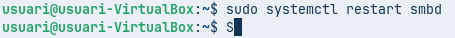

***

Tienes razón otra vez ✅ — eso también es importante y debe estar en la guía.  
Aquí tienes el bloque completo corregido en markdown para añadir al **Ejercicio 2**:

***

### Creació d’arxius de prova

Per comprovar que la carpeta pública funciona correctament, es creen alguns fitxers de text dins del directori:

```bash
sudo nano /srv/samba/publica/arxiu1.txt
sudo nano /srv/samba/publica/arxiu2.txt
```
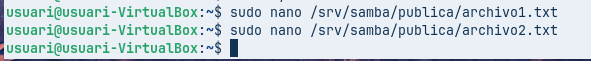

Dins dels fitxers es pot escriure qualsevol text senzill per fer la prova.

***

### Assignació de permisos

És important configurar correctament els permisos perquè qualsevol usuari pugui llegir els fitxers, però no modificar-los:

```bash
sudo chmod 755 /srv/samba/publica
sudo chmod 644 /srv/samba/publica/*
```
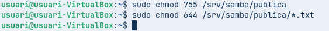

Aquests permisos permeten que:

*   Tothom pugui accedir a la carpeta
*   Tothom pugui llegir els fitxers
*   Només el propietari pugui modificar-los

***

### Comprovació

Des d’un equip client (Windows o Linux), s’ha d’accedir a:

    \\IP_DEL_SERVIDOR\publica

El resultat esperat és:

*   Es poden veure els fitxers
*   Es poden obrir i llegir
*   No es poden modificar ni eliminar

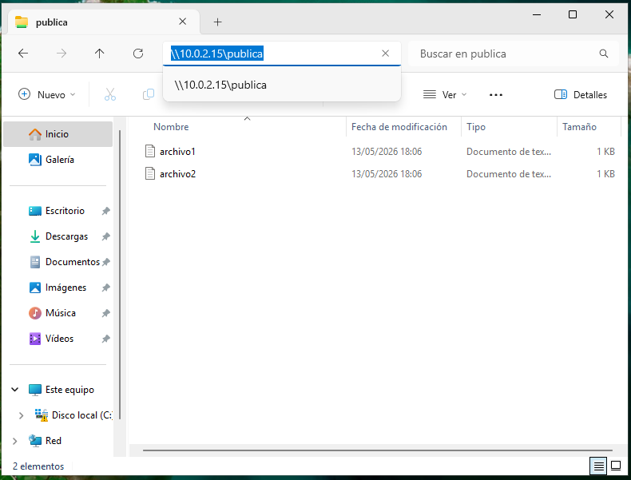

***

# 3. Carpetes personals

## Configuració

S’afegeix suport per carpetes personals:

```ini
[homes]
comment = Directoris personals
valid users = %S
read only = no
browseable = no
create mask = 0640
directory mask = 0750
```

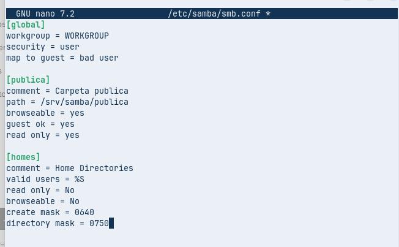

Cada usuari accedirà només a la seva carpeta personal.

***

## Accés

Des de Windows:

    \\IP_DEL_SERVIDOR\samba1

L’usuari tindrà accés total a la seva carpeta.

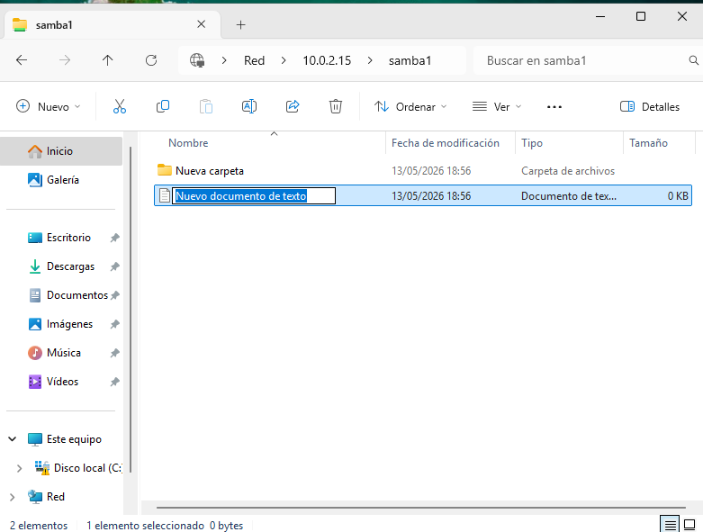

***

# 4. Carpeta compartida amb permisos

## Configuració

```bash
[compartida]
path = /srv/samba/compartida
browseable = yes
read only = no
valid users = samba1 samba2
write list = samba1
veto files = /*.zip/
```

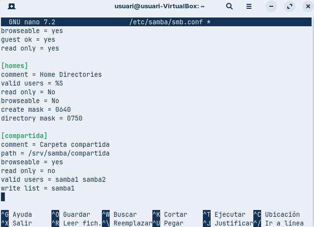

Aquesta configuració defineix diferents nivells d’accés:

*   samba1 pot llegir i escriure
*   samba2 només pot llegir
*   samba3 no pot accedir

També es bloquegen fitxers amb extensió .zip.

***

## Comprovació

Accés des de Windows:

    \\IP_DEL_SERVIDOR\compartida

Cada usuari tindrà permisos diferents segons la configuració.

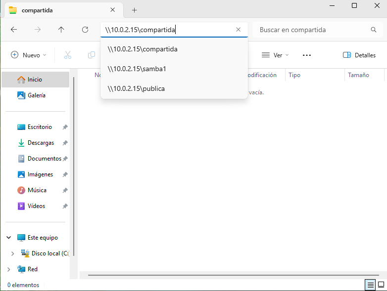

***

````markdown
### Bloqueig de fitxers .zip

En aquesta part es limita l’accés a certs tipus de fitxers. Tot i que els fitxers existeixen al servidor, no seran visibles des dels clients.

Per fer-ho, s’afegeix aquesta línia dins de la configuració de la carpeta compartida:

```ini
veto files = /*.zip/
````

Aquesta opció indica a Samba que no mostri cap arxiu amb extensió `.zip` als usuaris que accedeixen des de la xarxa.

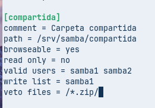

***

### Comprovació

Primer es crea un fitxer de prova:

```bash
cd /srv/samba/compartida
sudo zip prova.zip arxiu.txt
```
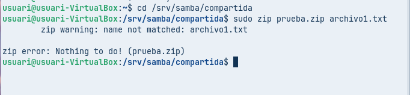

# 5. Accés des de Linux a Windows

## Instal·lació del paquet necessari

```bash
sudo apt install python3-smbc
```

Aquest paquet permet que Linux accedeixi a recursos compartits de Windows.

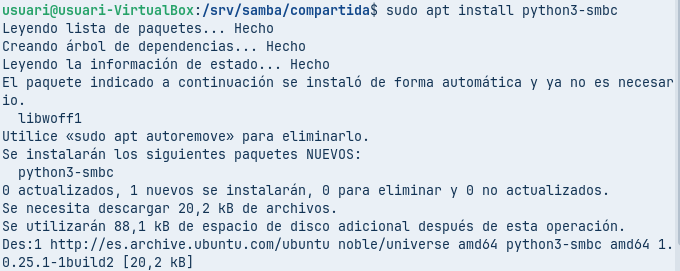

***

## Configuració a Windows

S’ha de crear una carpeta i compartir-la:

*   Afegir el grup `Everyone`
*   Permetre només lectura
*   Desactivar protecció amb contrasenya

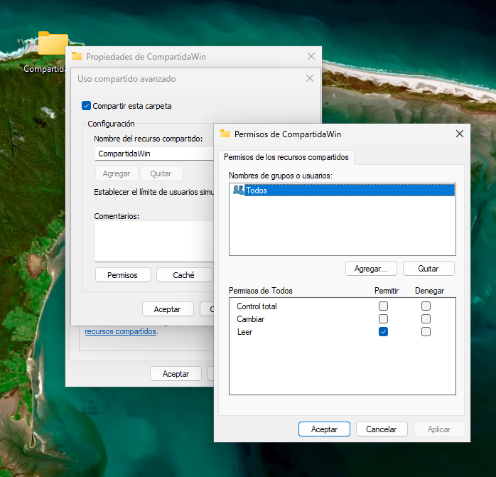

***

## Accés des de Zorin

Al gestor de fitxers:

    smb://IP_WINDOWS

o

    smb://IP_WINDOWS/CompartidaWin

Això permet veure la carpeta compartida de Windows.

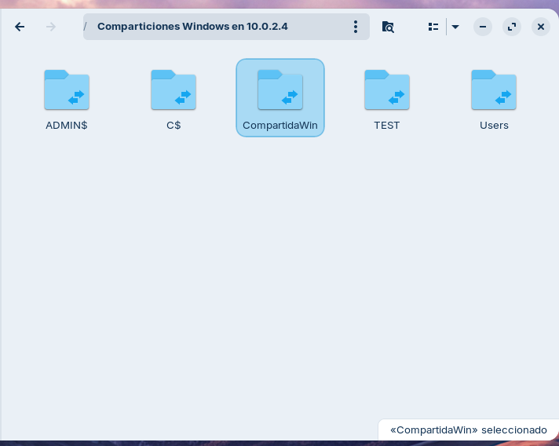

***


